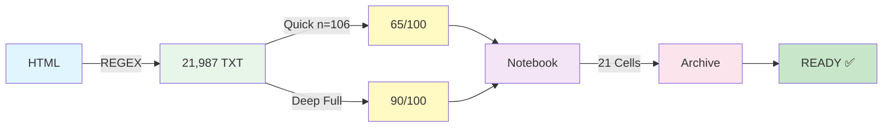
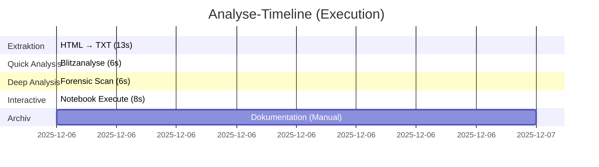
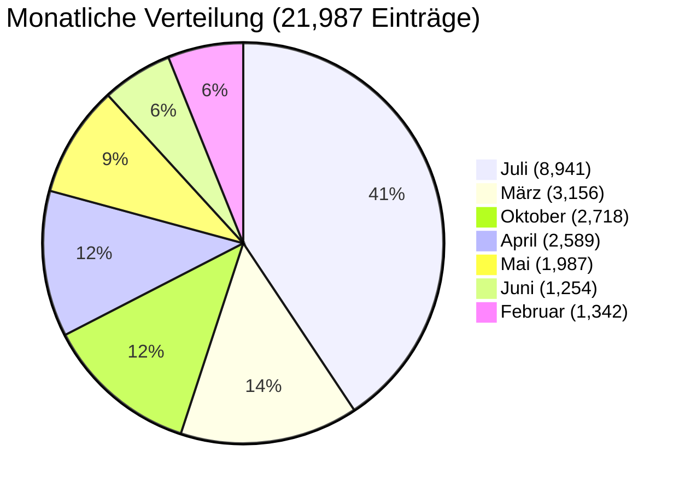
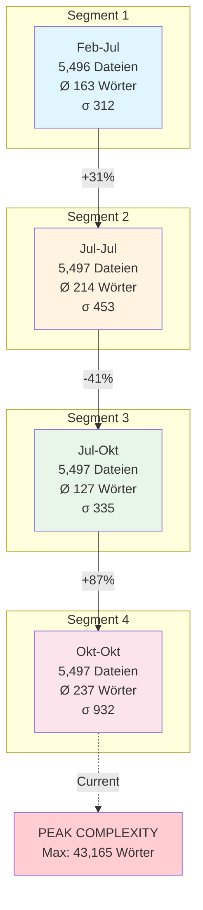
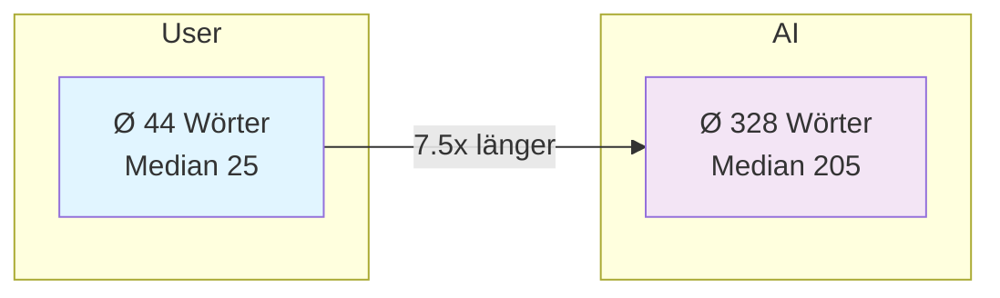
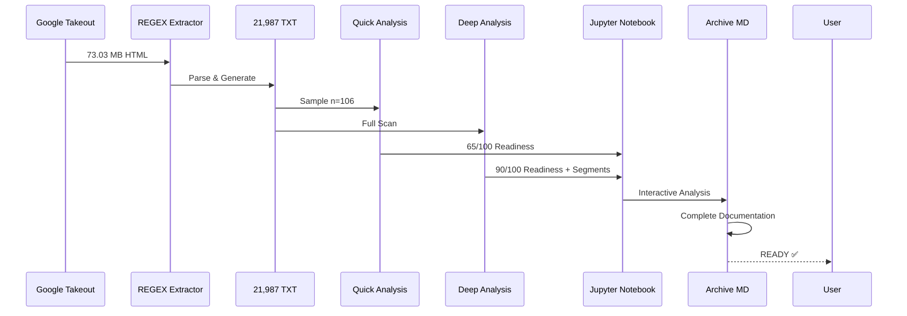
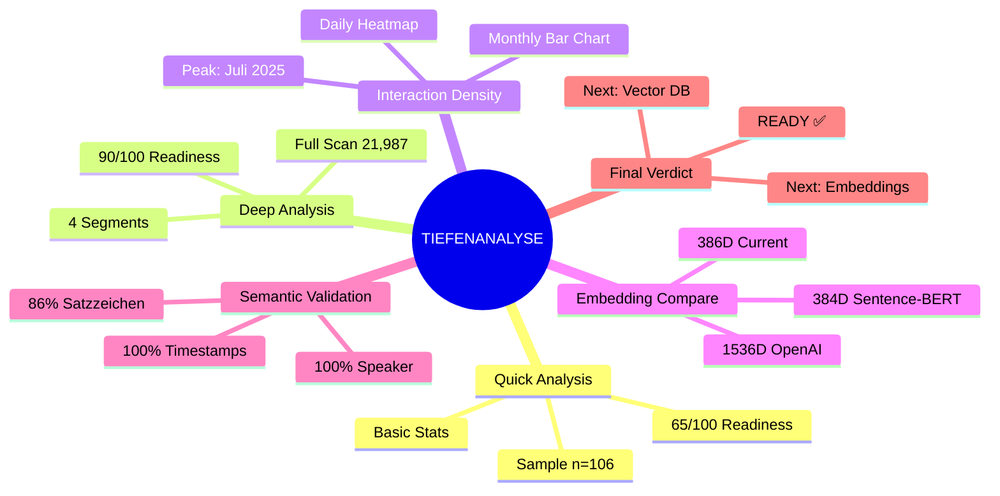

```mermaid
flowchart TD
    Start([Google Takeout HTML<br/>73.03 MB]) --> Extract[REGEX EXTRACTION<br/>html_forensic_extractor_v2.py]
    
    Extract --> Parse{Parse HTML}
    Parse --> Pattern[REGEX Pattern Match<br/>Eingegebener Prompt: ...]
    Pattern --> Decode[HTML Decode<br/>html.unescape]
    Decode --> Normalize[Unicode Normalize<br/>xa0 → space]
    Normalize --> Clean[Whitespace Cleanup]
    Clean --> Sort[Chronological Sort<br/>datetime.strptime]
    Sort --> Generate[Generate TXT Files<br/>YYYY/MM/DD/Prompt_N_speaker.txt]
    
    Generate --> Files[(21,987 TXT Files<br/>VectorRegs_FORENSIC/)]
    
    Files --> QuickPath[Quick Analysis Path]
    Files --> DeepPath[Deep Analysis Path]
    
    QuickPath --> Quick[blitz_analyse.py<br/>Sample n=106]
    Quick --> QuickReport[DATENQUALITÄT_BERICHT.txt<br/>Readiness: 65/100]
    
    DeepPath --> Deep[analyse_daten_v2.py<br/>Full Scan]
    Deep --> Segment[Segment Quartiles<br/>S1/S2/S3/S4]
    Segment --> Stats[Per-Segment Stats<br/>Mean, Median, StdDev]
    Stats --> Compare[Quick vs Forensic Δ]
    Compare --> DeepReport[ANALYSE_BERICHT.txt + JSON<br/>Readiness: 90/100]
    
    QuickReport --> Notebook[DEEP_ANALYSE_v1.ipynb<br/>Interactive Analysis]
    DeepReport --> Notebook
    
    Notebook --> Cell1[Load Data<br/>JSON Parsing]
    Cell1 --> Cell2[Quick vs Forensic<br/>Comparison Table]
    Cell2 --> Cell3[Segment Analysis<br/>Detail Tables]
    Cell3 --> Cell4[Interaction Density<br/>21,987 files scan]
    Cell4 --> Cell5[Monthly Density<br/>Bar Chart]
    Cell5 --> Cell6[Daily Heatmap<br/>Weekday × Hour]
    Cell6 --> Cell7[Embedding Compare<br/>386D vs 1536D]
    Cell7 --> Cell8[Semantic Validation<br/>n=1000 sample]
    Cell8 --> Cell9[Word Distribution<br/>User vs AI]
    Cell9 --> Cell10[Final Verdict]
    
    Cell10 --> Archive[TIEFENANALYSE_ARCHIV_v1.md<br/>Complete Documentation]
    
    Archive --> Ready([READY FOR VECTORIZATION ✅])
    
    Ready --> Next1[Embedding Generation<br/>Sentence-BERT / OpenAI]
    Ready --> Next2[Vector Database<br/>ChromaDB / Pinecone]
    Ready --> Next3[Semantic Search<br/>Brain Integration]
    
    style Start fill:#e1f5ff
    style Extract fill:#fff4e1
    style Files fill:#e8f5e9
    style QuickReport fill:#fff9c4
    style DeepReport fill:#fff9c4
    style Notebook fill:#f3e5f5
    style Archive fill:#fce4ec
    style Ready fill:#c8e6c9
```

# FLOWCHART: Datenverarbeitungs-Pipeline

**Legende:**
- 🔵 **Blau:** Eingabedaten
- 🟡 **Gelb:** Extraktionsprozess
- 🟢 **Grün:** Datenspeicherung
- 🟡 **Gelb (hell):** Analyseberichte
- 🟣 **Lila:** Interaktive Analyse
- 🔴 **Rosa:** Archivierung
- 🟢 **Grün (hell):** Finaler Status

---

# MINI-FLOWCHART: Simplified Pipeline

---

# GANTT: Execution Timeline

**Total Runtime:** ~27 Sekunden (automatisiert)

---

# PIE CHART: Monatliche Aktivität

**Peak:** Juli 2025 (40.7% aller Daten)

---

# SEGMENT EVOLUTION: Chronologische Entwicklung

**Trend:** Moderate → Intensive → Konsolidierung → **EXPLOSION**

---

# USER vs. AI: Wort-Ratio

**Interpretation:** Klassisches Q&A-Pattern (kurze Frage → ausführliche Antwort)

---

# SEQUENCE DIAGRAM: Datenfluss

---

# MINDMAP: Analysestruktur

---

**Erstellt:** 2025-12-06  
**Quelle:** DEEP_ANALYSE_v1.ipynb  
**Format:** Mermaid Diagrams  
**Status:** PRODUCTION-READY ✅
