# FLOWCHART: Datenverarbeitungs-Pipeline

**Legende:**
- 🔵 **Blau:** Eingabedaten
- 🟡 **Gelb:** Extraktionsprozess
- 🟢 **Grün:** Datenspeicherung
- 🟡 **Gelb (hell):** Analyseberichte
- 🟣 **Lila:** Interaktive Analyse
- 🔴 **Rosa:** Archivierung
- 🟢 **Grün (hell):** Finaler Status

---

```mermaid
graph LR
    A[HTML] -->|REGEX| B[21,987 TXT]
    B -->|Quick n=106| C[65/100]
    B -->|Deep Full| D[90/100]
    C --> E[Notebook]
    D --> E
    E -->|21 Cells| F[Archive]
    F --> G[READY ✅]
    
    style A fill:#e1f5ff
    style B fill:#e8f5e9
    style C fill:#fff9c4
    style D fill:#fff9c4
    style E fill:#f3e5f5
    style F fill:#fce4ec
    style G fill:#c8e6c9
```

# MINI-FLOWCHART: Simplified Pipeline

---

```mermaid
gantt
    title Analyse-Timeline (Execution)
    dateFormat  YYYY-MM-DD
    section Extraktion
    HTML → TXT (13s)           :a1, 2025-12-06, 13s
    section Quick Analysis
    Blitzanalyse (6s)          :a2, after a1, 6s
    section Deep Analysis
    Forensic Scan (6s)         :a3, after a1, 6s
    section Interactive
    Notebook Execute (8s)      :a4, after a3, 8s
    section Archiv
    Dokumentation (Manual)     :a5, after a4, 1d
```

# GANTT: Execution Timeline

**Total Runtime:** ~27 Sekunden (automatisiert)

---

```mermaid
pie title Monatliche Verteilung (21,987 Einträge)
    "Juli (8,941)" : 40.7
    "März (3,156)" : 14.4
    "Oktober (2,718)" : 12.4
    "April (2,589)" : 11.8
    "Mai (1,987)" : 9.0
    "Juni (1,254)" : 5.7
    "Februar (1,342)" : 6.1
```

# PIE CHART: Monatliche Aktivität

**Peak:** Juli 2025 (40.7% aller Daten)

---

```mermaid
graph TD
    subgraph Segment 1
    S1[Feb-Jul<br/>5,496 Dateien<br/>Ø 163 Wörter<br/>σ 312]
    end
    
    subgraph Segment 2
    S2[Jul-Jul<br/>5,497 Dateien<br/>Ø 214 Wörter<br/>σ 453]
    end
    
    subgraph Segment 3
    S3[Jul-Okt<br/>5,497 Dateien<br/>Ø 127 Wörter<br/>σ 335]
    end
    
    subgraph Segment 4
    S4[Okt-Okt<br/>5,497 Dateien<br/>Ø 237 Wörter<br/>σ 932]
    end
    
    S1 -->|+31%| S2
    S2 -->|-41%| S3
    S3 -->|+87%| S4
    
    S4 -.->|Current| Peak[PEAK COMPLEXITY<br/>Max: 43,165 Wörter]
    
    style S1 fill:#e1f5ff
    style S2 fill:#fff4e1
    style S3 fill:#e8f5e9
    style S4 fill:#fce4ec
    style Peak fill:#ffcdd2
```

# SEGMENT EVOLUTION: Chronologische Entwicklung

**Trend:** Moderate → Intensive → Konsolidierung → **EXPLOSION**

---

```mermaid
graph LR
    subgraph User
    U[Ø 44 Wörter<br/>Median 25]
    end
    
    subgraph AI
    A[Ø 328 Wörter<br/>Median 205]
    end
    
    U -->|7.5x länger| A
    
    style U fill:#e1f5ff
    style A fill:#f3e5f5
```

# USER vs. AI: Wort-Ratio

**Interpretation:** Klassisches Q&A-Pattern (kurze Frage → ausführliche Antwort)

---

# SEQUENCE DIAGRAM: Datenfluss

---

```mermaid
mindmap
  root((TIEFENANALYSE))
    Quick Analysis
      Sample n=106
      Basic Stats
      65/100 Readiness
    Deep Analysis
      Full Scan 21,987
      4 Segments
      90/100 Readiness
    Interaction Density
      Monthly Bar Chart
      Daily Heatmap
      Peak: Juli 2025
    Embedding Compare
      386D Current
      384D Sentence-BERT
      1536D OpenAI
    Semantic Validation
      100% Speaker
      100% Timestamps
      86% Satzzeichen
    Final Verdict
      READY ✅
      Next: Embeddings
      Next: Vector DB
```

# MINDMAP: Analysestruktur

---

**Erstellt:** 2025-12-06  
**Quelle:** DEEP_ANALYSE_v1.ipynb  
**Format:** Mermaid Diagrams  
**Status:** PRODUCTION-READY ✅
