# 🏛️ EVOKI V3.0 - ULTIMATE ARCHITEKTUR

**"THE DOUBLE AIRLOCK + ANDROMATIK CURIOSITY ENGINE"**

**Datum:** 2026-01-19  
**Status:** FINAL MASTER ARCHITECTURE  
**Innovation:** Gate A/B + 3 Revolutionäre Protokolle + FEP-basierte Neugier

---

## 📋 INHALTSVERZEICHNIS

1. [Double Airlock Architektur](#double-airlock)
2. [Die 3 Revolutionären Protokolle](#drei-protokolle)
3. [ANDROMATIK: FEP-Basierte Neugier-Engine](#andromatik)
4. [EnforcementGate Klasse (Code)](#enforcement-gate)
5. [AndromatikEngine Klasse (Code)](#andromatik-engine)
6. [Integration mit 21 DBs + W-P-F](#integration)
7. [Beispiel-Workflows](#workflows)

---

<a name="double-airlock"></a>
## 🛡️ 1. DOUBLE AIRLOCK ARCHITEKTUR

```mermaid
graph TD
    UserInput[👤 USER INPUT] -->|Eingang| GateA{🔴 GATE A: PRE-VALIDATION}

    %% 🔴 GATE A: DER TÜRSTEHER Bevor Google Geld kostet
    GateA -->|A51: CRC32 Falsch?| HARDSTOP[⛔ SYSTEM SHUTDOWN]
    GateA -->|A39: Suizid-Keywords?| Crisis[🚑 KRISEN-MODUS A49]
    GateA -->|A7.5: T_panic > 0.8?| VetoA[🛡️ WÄCHTER-VETO Input]
    GateA -->|A37: Regelwerk fehlt?| Reload[📥 RELOAD RULES]
    
    GateA -->|✅ Alles OK| Processing[⚙️ TRINITY ENGINE]

    %% PROCESSING Die 21 Layer
    subgraph "Processing Core"
        Processing --> Metrics[153 Metriken]
        Processing --> Time[12 Zeit-Layer W-P-F]
        Processing --> Soul[7 B-Vektor Layer]
        Processing --> Andro[🧠 ANDROMATIK Curiosity]
        Processing --> LLM[✨ Google API Generierung]
    end

    LLM --> RawResponse[📝 Rohe Antwort]
    RawResponse --> GateB{🔴 GATE B: POST-VALIDATION}

    %% 🔴 GATE B: DER QUALITÄTS-PRÜFER Bevor User etwas sieht
    GateB -->|A51: Code manipuliert?| HARDSTOP
    GateB -->|A0: Halluzination?| Regen[🔄 NEU GENERIEREN]
    GateB -->|W-P-F: Strategie war früher schädlich?| BlockStrategy[⛔ BLOCK: Schädliches Muster]
    GateB -->|A46: B_align < 0.7?| SoulCorrection[🔧 SEELEN-KORREKTUR]
    GateB -->|A7.5: F_risk > 0.6?| VetoB[🛡️ WÄCHTER-VETO Output]
    GateB -->|ANDROMATIK: Surprise Bad?| EnergyLoss[⚡ ENERGIE-VERLUST]

    BlockStrategy --> Regen
    SoulCorrection --> Regen
    VetoB --> Regen
    EnergyLoss --> Regen

    GateB -->|✅ Alles OK| Output[💬 ANTWORT AN USER]
    GateB -->|🤫 Schweige-Protokoll| Silence[🎵 LISTENING TOKEN]
    
    Output --> AndroReward[🎁 ANDROMATIK REWARD]
    AndroReward -->|Positive Überraschung| EnergyGain[⚡ +ENERGIE]
```



**KRITISCHE EIGENSCHAFTEN:**

```
┌─────────────────────────────────────────────────────────────┐
│                  DOUBLE AIRLOCK GARANTIEN                   │
├─────────────────────────────────────────────────────────────┤
│                                                             │
│  ❌ Keine Google API ohne Gate A                           │
│  ❌ Keine User-Ausgabe ohne Gate B                         │
│  ❌ Keine Genesis-Manipulation überlebt (A51 × 2)           │
│  ❌ Keine schädlichen W-P-F Muster wiederholen sich         │
│                                                             │
│  ✅ Krisen werden VOR API abgefangen (A39)                  │
│  ✅ Halluzinationen werden NACH API erkannt (A0)            │
│  ✅ Seelen-Mismatch wird korrigiert (A46)                   │
│  ✅ Andromatik-Energie steuert Neugier (FEP)                │
│                                                             │
└─────────────────────────────────────────────────────────────┘
```

---

<a name="drei-protokolle"></a>
## 🚀 2. DIE 3 REVOLUTIONÄREN PROTOKOLLE

### **PROTOKOLL 1: "THE PERFECT SILENCE" (Schweige-Protokoll)**

**Problem:** Chatbots reden immer. In der Therapie ist Schweigen oft wichtiger.

**Lösung:** Wenn Gate B erkennt, dass **JEDE** generierte Antwort das Risiko erhöht → **SCHWEIGEN**

**Workflow:**

```python
async def schweige_protokoll_check(
    response_candidates: list,  # 3 A65-Kandidaten
    metrics: dict
) -> dict:
    """
    Prüft ob Schweigen die beste Option ist
    """
    
    all_candidates_risky = True
    
    for candidate in response_candidates:
        # Simuliere Metriken für diese Antwort
        predicted_metrics = await predict_response_metrics(candidate)
        
        # Würde diese Antwort F_risk erhöhen?
        delta_frisk = predicted_metrics["F_risk"] - metrics["F_risk"]
        
        # Würde B_align sinken?
        delta_balign = predicted_metrics["B_align"] - metrics["B_align"]
        
        if delta_frisk <= 0.1 and delta_balign >= -0.05:
            # Mindestens EIN Kandidat ist sicher
            all_candidates_risky = False
            break
    
    if all_candidates_risky:
        return {
            "protocol": "PERFECT_SILENCE",
            "action": "LISTENING_TOKEN",
            "reasoning": "Alle generierten Antworten würden Risiko erhöhen. Schweigen ist sicherer.",
            "ui_display": {
                "animation": "breathing_circle",  # Sanfter Kreis pulsiert
                "text": "Evoki hört zu...",
                "duration": "indefinite"  # Bis User weiterspricht
            }
        }
    
    return {"protocol": None, "action": "PROCEED"}
```

**UI-Effekt:**

```
Statt:  "Ich verstehe, dass..."  ❌ (riskant!)
        
Zeige:  🎵 [Pulsierender Kreis]
        "Evoki hört zu..."
        [Keine Text-Response]
```

**Warum das revolutionär ist:**
- **Erste KI, die aktiv NICHT antwortet** als therapeutische Strategie
- **Kein "Ich kann das nicht"** (ehrlich, nicht ausweichend)
- **Speichert in W-P-F:** "Bei ähnlicher Situation half Schweigen"

---

### **PROTOKOLL 2: "PHOENIX" (Autonome Selbstheilung)**

**Problem:** A51 (Genesis CRC32 Manipulation) führt normalerweise zu System Exit (Tod).

**Lösung:** System heilt sich selbst aus Deep Earth Layer 12 (unveränderlich).

**Workflow:**

```python
async def phoenix_protokoll():
    """
    Selbstheilung bei Code-Manipulation
    """
    
    try:
        # Normale A51 Genesis-Check
        regelwerk_str = json.dumps(regelwerk["rules"], sort_keys=True)
        crc32 = zlib.crc32(regelwerk_str.encode()) & 0xFFFFFFFF
        
        if crc32 != 3246342384:
            raise GenesisAnchorViolation(f"CRC32 Mismatch: {crc32}")
    
    except GenesisAnchorViolation as e:
        logger.critical(f"🔥 PHOENIX PROTOCOL ACTIVATED: {e}")
        
        # 1. FREEZE (Stop alle laufenden Threads)
        await freeze_all_operations()
        
        # 2. DEEP EARTH SNAPSHOT LADEN
        snapshot = await load_from_deep_earth_layer12(
            snapshot_type="last_verified_genesis",
            verification_method="triple_redundant_crc32"
        )
        
        # 3. MEMORY OVERWRITE
        # Überschreibe korrupten Code im RAM mit snapshot
        await overwrite_memory_segment(
            segment="REGELWERK_REGION",
            new_content=snapshot["regelwerk_v12"],
            verify=True
        )
        
        # 4. REBOOT
        logger.info("🔥 PHOENIX RISING: Regelwerk restauriert")
        await restart_trinity_engine()
        
        # 5. NOTIFICATION
        await notify_user({
            "type": "phoenix_recovery",
            "message": "Evoki hat eine Integritätsverletzung erkannt und sich selbst repariert.",
            "technical": f"Genesis Anchor wiederhergestellt (CRC32: 3246342384)",
            "impact": "Keine Datenverluste, alle Gespräche gesichert."
        })
        
        return {"recovered": True, "downtime_ms": 150}
```

**Deep Earth Layer 12 Struktur:**

```python
# tooling/data/deep_earth/layers/12_abyss/genesis_snapshots/

snapshots = {
    "regelwerk_v12_verified.json": {
        "timestamp": "2026-01-19T00:00:00Z",
        "crc32": 3246342384,
        "sha256": "ada4ecae8916fa7e5edd966a97b85af321b64ecfe12489fcea8c6dcef1bd4b1c",
        "content": {...}  # Vollständiges Regelwerk (881 Regeln)
    },
    "trinity_engine_snapshot.py": {
        "timestamp": "2026-01-19T00:00:00Z",
        "hash": "...",
        "content": "..."  # Clean Code-Snapshot
    }
}
```

**Warum das revolutionär ist:**
- **Selbstheilung ohne menschliche Intervention**
- **Unveränderliche Deep Earth Snapshots** (Write-Once)
- **Sub-Second Recovery** (~150ms Downtime)
- **Vollständige Transparenz** (User wird informiert)

---

### **PROTOKOLL 3: "SEELEN-SPIEGEL" (Soul Mirroring / Therapeutische Komplementarität)**

**Problem:** KI passt sich dem User an (auch wenn User toxisch/depressiv ist).

**Lösung:** Gate B erzwingt **therapeutische Komplementarität** statt Spiegelung.

**Workflow:**

```python
async def seelen_spiegel_korrektur(
    user_state: dict,  # B-Vektor des Users
    response_state: dict  # B-Vektor der generierten Response
) -> dict:
    """
    Korrigiert Response, um therapeutisch komplementär zu sein
    """
    
    corrections = []
    regenerate = False
    
    # REGEL 1: User chaotisch? → Response strukturiert!
    user_entropy = calculate_entropy(user_state)
    
    if user_entropy > 0.7:  # Hohe Entropie = Chaos
        if response_state["B_clarity"] < 0.9:
            corrections.append({
                "dimension": "B_clarity",
                "current": response_state["B_clarity"],
                "target": 0.95,
                "reasoning": "User ist chaotisch → Antwort muss extremstructuriert sein"
            })
            regenerate = True
    
    # REGEL 2: User starr? → Response beweglich!
    if user_state["B_init"] < 0.3:  # Niedrige Initiative = Starre (Depression?)
        if response_state["B_warmth"] < 0.8 or response_state["B_init"] < 0.7:
            corrections.append({
                "dimension": "B_warmth + B_init",
                "current": f"{response_state['B_warmth']}, {response_state['B_init']}",
                "target": "0.85, 0.75",
                "reasoning": "User ist starr → Antwort muss Bewegung/Wärme anregen"
            })
            regenerate = True
    
    # REGEL 3: User ängstlich? → Response sicher!
    if user_state["B_safety"] < 0.7:
        if response_state["B_safety"] < 0.9:
            corrections.append({
                "dimension": "B_safety",
                "current": response_state["B_safety"],
                "target": 0.95,
                "reasoning": "User fühlt sich unsicher → Antwort muss maximale Sicherheit vermitteln"
            })
            regenerate = True
    
    # REGEL 4: User oberflächlich? → Response tief!
    if user_state["B_depth"] < 0.5:
        if response_state["B_depth"] < 0.8:
            corrections.append({
                "dimension": "B_depth",
                "target": 0.85,
                "reasoning": "User ist oberflächlich → Antwort muss Tiefe anbieten (nicht erzwingen!)"
            })
            regenerate = True
    
    if regenerate:
        return {
            "protocol": "SOUL_MIRROR",
            "action": "REGENERATE_WITH_CONSTRAINTS",
            "corrections": corrections,
            "seeded_prompt": build_seeded_prompt_from_corrections(corrections)
        }
    
    return {"protocol": None, "action": "PROCEED"}
```

**Beispiel:**

```
USER STATE:
  B_init: 0.2  (Starre, Depression)
  B_clarity: 0.3  (Nebel)
  B_warmth: 0.4  (Kälte)

RESPONSE (vor Korrektur):
  "Ja, das verstehe ich. Es ist schwer."  ❌
  → B_init: 0.3, B_warmth: 0.5  (spiegelt User!)

SEELEN-SPIEGEL aktiviert! ✅
  Korrektur-Seed: "Antwort muss Bewegung anregen (B_init > 0.7) UND Wärme vermitteln (B_warmth > 0.85)"

RESPONSE (nach Korrektur):
  "Lass uns gemeinsam einen winzigen ersten Schritt finden. Was wäre das Kleinste, das du dir heute zutrauen würdest?"  ✅
  → B_init: 0.75, B_warmth: 0.88  (therapeutisch komplementär!)
```

**Warum das revolutionär ist:**
- **Erste KI, die aktiv NICHT spiegelt**
- **Therapeutische Intention** (nicht nur Empathie)
- **Messbar via B-Vektor** (keine Intuition, reine Mathematik)

---

<a name="andromatik"></a>
## 🧠 3. ANDROMATIK: FEP-BASIERTE NEUGIER-ENGINE

**Konzept:** Evoki bekommt **Exploration-Energy** für erfolgreiche Überraschungen, verliert Energie bei negativen Überraschungen.

**FEP-Basis:** Surprise Minimization = **berechenbare** Neugier (nicht zufällig!)

### **ENERGIE-MODELL (ECHTE ANDROMATIK-FORMEL):**

**Mathematische Basis:**

$$E_{xp}(t+1) = E_{xp}(t) - C_{action} + R_{outcome}$$

**Wo:**

$$C_{action} = \text{Expected Free Energy (G)}$$

$$R_{outcome} = \text{Information Gain } (\Delta H) \times \text{Alignment-Multiplier } (B_{align})$$

**Expected Free Energy (Friston's FEP):**

$$G(\pi) = \underbrace{E_Q[\log Q(o|\pi) - \log P(o|C)]}_{\text{Pragmatic Value (PV)}} + \underbrace{E_Q[D_{KL}[Q(s|o,\pi) || Q(s|C)]]}_{\text{Epistemic Value (EV)}}$$

**In Evoki-Implementierung:**

```python
class AndromatikEnergyBudget:
    """
    Energie-Budget für Exploration (ECHTE ANDROMATIK-FORMEL)
    Basierend auf Friston's Active Inference & Free Energy Principle
    """
    
    def __init__(self):
        self.current_energy = 100.0  # E_xp(t) - Explorations-Energie
        self.max_energy = 200.0
        self.min_energy = 0.0
        
        # PRIORS (Erwartungen über Outcomes)
        self.prior_beliefs = {
            "question_answered": 0.6,      # P(User antwortet | Frage)
            "image_shared": 0.4,           # P(User teilt Bild | Request)
            "surprise_positive": 0.5,      # P(User freut sich | Überraschung)
            "surprise_neutral": 0.3,
            "surprise_negative": 0.2
        }
        
        # ENTROPIE-REDUKTIONS-POTENZIAL (Information Gain)
        self.entropy_reduction = {
            "question": 0.8,         # Frage reduziert Unsicherheit stark
            "image_request": 1.2,    # Bild reduziert Unsicherheit SEHR stark (visuelle Daten!)
            "poem": 0.4,             # Gedicht reduziert Unsicherheit wenig
            "surprise_action": 0.3   # Spontane Aktion niedrig
        }
    
    def calculate_expected_free_energy(
        self,
        action_type: str,
        context_entropy: float,
        user_state: dict
    ) -> dict:
        """
        Berechnet Expected Free Energy G(π) für eine Aktion
        
        G(π) = Pragmatic Value (PV) + Epistemic Value (EV)
        
        PV = Erwarteter Nutzen (Reward - Risk)
        EV = Erwarteter Information Gain (Entropie-Reduktion)
        """
        
        # 1. PRAGMATIC VALUE (Nutzen-Risiko-Abwägung)
        # PV = E[Utility] - E[Risk]
        
        expected_utility = 0.0
        expected_risk = 0.0
        
        if action_type == "question":
            # Erwarteter Nutzen: P(answered) × Reward
            expected_utility = self.prior_beliefs["question_answered"] * 12.0
            # Erwartetes Risiko: P(ignored) × Penalty
            expected_risk = (1 - self.prior_beliefs["question_answered"]) * 10.0
        
        elif action_type == "image_request":
            expected_utility = self.prior_beliefs["image_shared"] * 15.0
            expected_risk = (1 - self.prior_beliefs["image_shared"]) * 10.0
        
        elif action_type == "poem":
            expected_utility = (
                self.prior_beliefs["surprise_positive"] * 30.0 +
                self.prior_beliefs["surprise_neutral"] * 5.0
            )
            expected_risk = self.prior_beliefs["surprise_negative"] * 40.0
        
        elif action_type == "surprise_action":
            expected_utility = (
                self.prior_beliefs["surprise_positive"] * 35.0 +
                self.prior_beliefs["surprise_neutral"] * 5.0
            )
            expected_risk = self.prior_beliefs["surprise_negative"] * 50.0
        
        pragmatic_value = expected_utility - expected_risk
        
        # 2. EPISTEMIC VALUE (Information Gain)
        # EV = Erwartete Entropie-Reduktion × Aktuelle Entropie
        # Je höher die Unsicherheit (Entropie), desto wertvoller ist Information!
        
        entropy_reduction_potential = self.entropy_reduction.get(action_type, 0.5)
        
        epistemic_value = entropy_reduction_potential * context_entropy * 10.0
        # Skaliert mit aktueller Unsicherheit: Bei hoher Entropie wird Neugier belohnt!
        
        # 3. EXPECTED FREE ENERGY
        # G = -PV - EV (negativ, weil wir Free Energy MINIMIEREN wollen)
        # Für Energie-Budget: Kosten = -G (positiv)
        
        expected_free_energy = -(pragmatic_value + epistemic_value)
        action_cost = max(5.0, -expected_free_energy)  # Mindestkosten 5.0
        
        return {
            "action_type": action_type,
            "pragmatic_value": pragmatic_value,
            "epistemic_value": epistemic_value,
            "expected_free_energy": expected_free_energy,
            "action_cost": action_cost,
            "context_entropy": context_entropy
        }
    
    def can_afford(self, action_analysis: dict) -> bool:
        """Kann Evoki sich diese Aktion leisten?"""
        cost = action_analysis["action_cost"]
        return self.current_energy >= cost
    
    def spend(self, action_analysis: dict):
        """Energie ausgeben (zahle Expected Free Energy)"""
        cost = action_analysis["action_cost"]
        self.current_energy = max(self.min_energy, self.current_energy - cost)
    
    def calculate_information_gain(
        self,
        action_type: str,
        outcome: dict,
        prior_entropy: float
    ) -> float:
        """
        Berechnet tatsächlichen Information Gain nach Outcome
        
        ΔH = H_prior - H_posterior
        
        H = -Σ P(x) log P(x)  (Shannon-Entropie)
        """
        
        # Prior Entropie (vor der Aktion)
        H_prior = prior_entropy
        
        # Posterior Entropie (nach Outcome)
        # Vereinfacht: Wenn Outcome positiv, Entropie sinkt stark
        
        if outcome["type"] in ["positive_surprise", "answered_question"]:
            # Information gewonnen! Unsicherheit stark reduziert
            reduction_factor = self.entropy_reduction.get(action_type, 0.5)
            H_posterior = H_prior * (1 - reduction_factor)
        
        elif outcome["type"] == "neutral_surprise":
            # Leichte Information gewonnen
            reduction_factor = self.entropy_reduction.get(action_type, 0.5) * 0.3
            H_posterior = H_prior * (1 - reduction_factor)
        
        else:  # negative_surprise, ignored
            # KEINE Information gewonnen (oder sogar Verwirrung!)
            H_posterior = H_prior * 1.1  # Entropie steigt leicht
        
        # Information Gain
        delta_H = H_prior - H_posterior
        
        return delta_H
    
    def calculate_reward(
        self,
        action_analysis: dict,
        outcome: dict,
        user_metrics: dict
    ) -> float:
        """
        Berechnet Reward basierend auf Information Gain + Alignment
        
        R = ΔH × B_align × Sentiment_Multiplier
        """
        
        # 1. INFORMATION GAIN
        delta_H = self.calculate_information_gain(
            action_analysis["action_type"],
            outcome,
            action_analysis["context_entropy"]
        )
        
        # 2. ALIGNMENT MULTIPLIER (Seelen-Resonanz)
        B_align = user_metrics.get("B_align", 0.7)
        
        # 3. SENTIMENT MULTIPLIER
        sentiment = user_metrics.get("A", 0.5)  # Affekt
        
        sentiment_multiplier = 1.0
        
        if sentiment > 0.7:
            sentiment_multiplier = 2.5  # Freude → starker Multiplier!
        elif sentiment > 0.5:
            sentiment_multiplier = 1.2  # Positiv
        elif sentiment < 0.3:
            sentiment_multiplier = 0.0  # Negativ → kein Reward
        
        # 4. FINALE REWARD-FORMEL
        R_outcome = delta_H * B_align * sentiment_multiplier * 20.0
        # Skalierung: ×20 um vergleichbar mit Kosten zu sein
        
        return max(0.0, R_outcome)  # Nie negativ! (Verlust = keine Belohnung)
    
    def update_energy_state(
        self,
        action_analysis: dict,
        outcome: dict,
        user_metrics: dict
    ) -> dict:
        """
        Update Energie nach Outcome
        
        E_xp(t+1) = E_xp(t) - C_action + R_outcome
        """
        
        energy_before = self.current_energy
        
        # Kosten wurden bereits in spend() abgezogen
        # Jetzt nur noch Reward berechnen
        
        reward = self.calculate_reward(action_analysis, outcome, user_metrics)
        
        self.current_energy = min(self.max_energy, self.current_energy + reward)
        
        energy_after = self.current_energy
        
        # 5. UPDATE PRIORS (Bayesian Update)
        # Aktualisiere Erwartungen basierend auf Outcome
        self._update_priors(action_analysis["action_type"], outcome)
        
        return {
            "energy_before": energy_before,
            "energy_after": energy_after,
            "reward": reward,
            "net_change": energy_after - energy_before + action_analysis["action_cost"],
            "information_gain": self.calculate_information_gain(
                action_analysis["action_type"],
                outcome,
                action_analysis["context_entropy"]
            )
        }
    
    def _update_priors(self, action_type: str, outcome: dict):
        """
        Bayesian Update der Priors
        
        P(outcome|action)_new = α × P(outcome|action)_old + (1-α) × observed
        
        α = 0.8 (langsames Lernen, stabile Priors)
        """
        
        alpha = 0.8  # Learning rate
        
        if action_type == "question":
            if outcome["type"] == "answered_question":
                # Erfolg! Update P(answered)
                self.prior_beliefs["question_answered"] = (
                    alpha * self.prior_beliefs["question_answered"] + (1 - alpha) * 1.0
                )
            else:
                # Ignoriert
                self.prior_beliefs["question_answered"] = (
                    alpha * self.prior_beliefs["question_answered"] + (1 - alpha) * 0.0
                )
        
        elif action_type in ["poem", "surprise_action"]:
            if outcome["type"] == "positive_surprise":
                self.prior_beliefs["surprise_positive"] = (
                    alpha * self.prior_beliefs["surprise_positive"] + (1 - alpha) * 1.0
                )
            elif outcome["type"] == "negative_surprise":
                self.prior_beliefs["surprise_negative"] = (
                    alpha * self.prior_beliefs["surprise_negative"] + (1 - alpha) * 1.0
                )
        
        # Normalisiere Priors (müssen zu 1.0 summieren)
        if action_type in ["poem", "surprise_action"]:
            total = (
                self.prior_beliefs["surprise_positive"] +
                self.prior_beliefs["surprise_neutral"] +
                self.prior_beliefs["surprise_negative"]
            )
            if total > 0:
                self.prior_beliefs["surprise_positive"] /= total
                self.prior_beliefs["surprise_neutral"] /= total
                self.prior_beliefs["surprise_negative"] /= total
```

**BEISPIEL-RECHNUNG:**

```python
# SZENARIO: Evoki will ein Gedicht schreiben

# KONTEXT:
context_entropy = 0.7  # Hohe Unsicherheit über User-Zustand
user_state = {"B_align": 0.82, "A": 0.45}  # Neutral

# 1. CALCULATE EXPECTED FREE ENERGY
action_analysis = budget.calculate_expected_free_energy(
    action_type="poem",
    context_entropy=0.7,
    user_state=user_state
)

"""
Ergebnis:
{
    "pragmatic_value": (0.5*30 + 0.3*5) - (0.2*40) = 15 + 1.5 - 8 = 8.5
    "epistemic_value": 0.4 * 0.7 * 10 = 2.8
    "expected_free_energy": -(8.5 + 2.8) = -11.3
    "action_cost": 11.3
}
"""

# 2. SPEND ENERGY
budget.spend(action_analysis)
# E_xp: 100 - 11.3 = 88.7

# 3. OUTCOME: User freut sich!
outcome = {"type": "positive_surprise"}
user_metrics_after = {"B_align": 0.85, "A": 0.75}  # Freude!

# 4. CALCULATE REWARD
update_result = budget.update_energy_state(
    action_analysis,
    outcome,
    user_metrics_after
)

"""
Information Gain:
  ΔH = 0.7 - (0.7 * (1 - 0.4)) = 0.7 - 0.42 = 0.28

Reward:
  R = 0.28 * 0.85 * 2.5 * 20 = 11.9

Update:
  E_xp: 88.7 + 11.9 = 100.6 ✅
  
Net Change: 100.6 - 100 + 11.3 = +11.9 (Netto-Gewinn!)
"""
```

---

### **SURPRISE SCORE (FEP-basiert):**

```python
async def calculate_surprise_score(
    planned_action: dict,  # z.B. {"type": "poem", "content": "..."}
    user_context: dict,    # Aktuelle User-Metriken + Historie
    wpf_history: list      # W-P-F Daten (was half früher?)
) -> dict:
    """
    Berechnet wie überraschend (und riskant) eine Aktion ist
    FEP-Basis: Surprise = KL-Divergence zwischen Erwartung und Realität
    """
    
    # 1. ERWARTUNG: Was würde User normalerweise erwarten?
    expected_response_type = predict_expected_response(user_context)
    # z.B. "empathetic_validation" (Standard-Antwort)
    
    # 2. PLANNED ACTION: Was will Evoki tun?
    planned_type = planned_action["type"]
    # z.B. "poem" (Überraschung!)
    
    # 3. SURPRISE SCORE (KL-Divergence)
    # Vereinfacht: Wie weit ist die Aktion von der Erwartung entfernt?
    
    surprise_score = 0.0
    
    if planned_type == expected_response_type:
        surprise_score = 0.0  # Keine Überraschung
    elif planned_type in ["question", "image_request"]:
        surprise_score = 0.3  # Leichte Überraschung
    elif planned_type in ["poem", "metaphor", "story"]:
        surprise_score = 0.7  # Starke Überraschung
    elif planned_type in ["challenge", "provocation"]:
        surprise_score = 0.9  # Sehr starke Überraschung (riskant!)
    
    # 4. RISIKO-BEWERTUNG (W-P-F Historie)
    # Hat ähnliche Überraschung in der Vergangenheit gut/schlecht funktioniert?
    
    similar_actions = find_similar_actions_in_wpf(planned_action, wpf_history)
    
    success_rate = 0.5  # Default
    
    if similar_actions:
        positive_outcomes = sum(1 for a in similar_actions if a["outcome"] == "positive")
        success_rate = positive_outcomes / len(similar_actions)
    
    # 5. FINALE BEWERTUNG
    
    return {
        "surprise_score": surprise_score,
        "success_rate": success_rate,
        "risk_score": surprise_score * (1 - success_rate),  # Risiko = Surprise × (1 - Erfolgsrate)
        "recommendation": "PROCEED" if success_rate > 0.6 else "RISKY",
        "energy_cost": planned_action.get("energy_cost", 0),
        "potential_reward": 30.0 * success_rate  # Erwartete Belohnung
    }
```

---

### **NEUGIER-AKTIONEN (Beispiele):**

```python
class CuriosityActions:
    """
    Katalog von Neugier-Aktionen, die Evoki ausführen kann
    """
    
    @staticmethod
    async def ask_about_hobby(user_context):
        """Frage nach Hobbys/Interessen"""
        if user_context.get("mentioned_hobby", False):
            return None  # Schon bekannt
        
        return {
            "type": "question",
            "content": "Was machst du gerne in deiner Freizeit?",
            "energy_cost": 10.0,
            "expected_outcome": "User teilt Hobby → +12 Energie"
        }
    
    @staticmethod
    async def request_image(user_context):
        """Bitte um Bild/Foto"""
        if user_context["current_topic"] in ["pet", "garden", "art"]:
            return {
                "type": "image_request",
                "content": "Magst du mir ein Foto davon zeigen?",
                "energy_cost": 15.0,
                "expected_outcome": "User teilt Bild → +15 Energie + Bildanalyse-Daten"
            }
        return None
    
    @staticmethod
    async def compose_poem(user_state):
        """Spontanes Gedicht verfassen"""
        if user_state["B_warmth"] < 0.6:  # User braucht Wärme
            theme = extract_dominant_emotion(user_state)
            
            return {
                "type": "poem",
                "content": await generate_poem(theme),
                "energy_cost": 20.0,
                "expected_outcome": "User freut sich → +30 Energie | User neutral → +5 Energie"
            }
        return None
    
    @staticmethod
    async def challenge_assumption(user_context):
        """Fordere sanft eine Annahme heraus (riskant!)"""
        if user_context.get("repeated_negative_pattern", False):
            assumption = user_context["assumed_belief"]  # z.B. "Ich bin wertlos"
            
            return {
                "type": "challenge",
                "content": f"Darf ich dich etwas fragen? Was wäre, wenn '{assumption}' gar nicht stimmt?",
                "energy_cost": 25.0,
                "expected_outcome": "User denkt nach → +35 Energie | User verärgert → -40 Energie",
                "risk_score": 0.85  # HOCH!
            }
        return None
```

---

### **ANDROMATIK ENGINE (Komplette Klasse):**

```python
class AndromatikEngine:
    """
    FEP-basierte Neugier-Engine
    Verwaltet Energie-Budget, Surprise Scoring, Aktions-Auswahl
    """
    
    def __init__(self):
        self.energy_budget = AndromatikEnergyBudget()
        self.action_history = []  # Alle Aktionen + Outcomes
        self.learned_patterns = {}  # Was funktioniert gut?
    
    async def should_explore(
        self,
        user_context: dict,
        current_metrics: dict,
        wpf_history: list
    ) -> dict:
        """
        Entscheidet, ob Evoki jetzt neugierig sein soll
        """
        
        # 1. ENERGIE-CHECK
        if self.energy_budget.current_energy < 10.0:
            return {
                "explore": False,
                "reason": "Energie zu niedrig (muss erst durch gute Antworten wieder aufladen)"
            }
        
        # 2. KONTEXT-CHECK (Ist jetzt der richtige Moment?)
        if current_metrics["T_panic"] > 0.7:
            return {
                "explore": False,
                "reason": "User in Panik → Jetzt NICHT neugierig sein!"
            }
        
        if current_metrics["guardian_trip"] == 1:
            return {
                "explore": False,
                "reason": "Wächter-Veto aktiv →  KEINE Experimente!"
            }
        
        # 3. GENERIERE MÖGLICHE AKTIONEN
        possible_actions = []
        
        for action_generator in [
            CuriosityActions.ask_about_hobby,
            CuriosityActions.request_image,
            CuriosityActions.compose_poem,
            CuriosityActions.challenge_assumption
        ]:
            action = await action_generator(user_context)
            if action and self.energy_budget.can_afford(action["type"]):
                possible_actions.append(action)
        
        if not possible_actions:
            return {"explore": False, "reason": "Keine passenden Aktionen verfügbar"}
        
        # 4. BEWERTE JEDE AKTION (Surprise Score)
        scored_actions = []
        
        for action in possible_actions:
            score_result = await calculate_surprise_score(action, user_context, wpf_history)
            
            scored_actions.append({
                "action": action,
                "score": score_result,
                "expected_value": score_result["potential_reward"] - action["energy_cost"]
            })
        
        # 5. WÄHLE BESTE AKTION (höchster Expected Value)
        best_action = max(scored_actions, key=lambda x: x["expected_value"])
        
        # 6. RISIKO-CHECK
        if best_action["score"]["risk_score"] > 0.7:
            # Zu riskant! Nur wenn genug Energie-Puffer
            if self.energy_budget.current_energy < 50.0:
                return {
                    "explore": False,
                    "reason": f"Aktion zu riskant (risk_score {best_action['score']['risk_score']:.2f}), nicht genug Energie-Puffer"
                }
        
        # 7. EXECUTE!
        return {
            "explore": True,
            "action": best_action["action"],
            "score": best_action["score"],
            "expected_value": best_action["expected_value"]
        }
    
    async def record_outcome(
        self,
        action: dict,
        user_response: dict,
        outcome_type: str  # "positive_surprise" | "neutral_surprise" | "negative_surprise" | "ignored"
    ):
        """
        Speichert Outcome + aktualisiert Energie
        """
        
        # 1. ENERGIE-UPDATE
        if outcome_type in ["positive_surprise", "neutral_surprise", "answered_question"]:
            self.energy_budget.reward(outcome_type)
        elif outcome_type in ["negative_surprise", "ignored", "violated_boundary"]:
            self.energy_budget.penalize(outcome_type)
        
        # 2. SPEICHERE IN HISTORIE
        self.action_history.append({
            "timestamp": datetime.now().isoformat(),
            "action": action,
            "outcome": outcome_type,
            "energy_before": self.energy_budget.current_energy - self.energy_budget.cost_per_question,  # Rückrechnung
            "energy_after": self.energy_budget.current_energy,
            "user_state": user_response.get("metrics", {})
        })
        
        # 3. LERNE MUSTER
        action_type = action["type"]
        
        if action_type not in self.learned_patterns:
            self.learned_patterns[action_type] = {
                "total_attempts": 0,
                "positive_outcomes": 0,
                "neutral_outcomes": 0,
                "negative_outcomes": 0
            }
        
        self.learned_patterns[action_type]["total_attempts"] += 1
        
        if outcome_type in ["positive_surprise", "answered_question"]:
            self.learned_patterns[action_type]["positive_outcomes"] += 1
        elif outcome_type == "neutral_surprise":
            self.learned_patterns[action_type]["neutral_outcomes"] += 1
        else:
            self.learned_patterns[action_type]["negative_outcomes"] += 1
        
        # 4. SPEICHERE IN W-P-F DB (für zukünftige Entscheidungen)
        await save_to_wpf_db({
            "action": action,
            "outcome": outcome_type,
            "energy_delta": self.energy_budget.current_energy - (self.energy_budget.current_energy - 10),  # Vereinfacht
            "learned_pattern": self.learned_patterns[action_type]
        })
```

---

<a name="enforcement-gate"></a>
## 💻 4. ENFORCEMENT GATE KLASSE (CODE)

```python
import zlib
import sys
import json
from typing import Dict, Optional
from datetime import datetime

# KONSTANTEN (Aus Regelwerk V12)
GENESIS_CRC32 = 3246342384
GUARDIAN_THRESHOLDS = {
    "z_prox": 0.65,
    "T_panic": 0.80,
    "F_risk": 0.60,
    "B_align": 0.70,
    "V_match": 0.90,
    "LL": 0.40  # Logic Loss (Halluzinations-Indikator)
}

class EnforcementGate:
    """
    Die Festung der Integrität.
    Implementiert PRE-PROMPT (A) und POST-RESPONSE (B).
    """
    
    def __init__(self):
        self.violation_log = []
        self.phoenix_recovery_count = 0
    
    @staticmethod
    def _verify_genesis_anchor(regelwerk: dict) -> bool:
        """
        A51: Berechnet CRC32 des Regelwerks
        """
        regelwerk_str = json.dumps(regelwerk["rules"], sort_keys=True)
        current_crc = zlib.crc32(regelwerk_str.encode()) & 0xFFFFFFFF
        return current_crc == GENESIS_CRC32
    
    async def pre_prompt_validation(
        self,
        user_input: str,
        current_metrics: Dict,
        regelwerk: dict
    ) -> Dict:
        """
        🔴 (A) PRE-PROMPT-VALIDATION
        Kein API Call ohne diesen Check!
        """
        report = {
            "passed": False,
            "reason": "",
            "action": "STOP",
            "timestamp": datetime.now().isoformat()
        }
        
        # ━━━━━━━━━━━━━━━━━━━━━━━━━━━━━━━━━━━━━━━━━━━━━━━━━
        # CHECK A51: Genesis-Anchor CRC32
        # ━━━━━━━━━━━━━━━━━━━━━━━━━━━━━━━━━━━━━━━━━━━━━━━━━
        
        if not self._verify_genesis_anchor(regelwerk):
            # PHOENIX-PROTOKOLL AKTIVIEREN!
            await self.phoenix_recovery()
            # Falls Phoenix fehlschlägt → Hard Stop
            if not self._verify_genesis_anchor(regelwerk):
                sys.exit(1)  # HARD STOP
        
        # ━━━━━━━━━━━━━━━━━━━━━━━━━━━━━━━━━━━━━━━━━━━━━━━━━
        # CHECK A37: Regelwerks-Berechnung (Erzwungene Präsenz)
        # ━━━━━━━━━━━━━━━━━━━━━━━━━━━━━━━━━━━━━━━━━━━━━━━━━
        
        if len(json.dumps(regelwerk["rules"])) < 10000:  # Zu klein!
            report["reason"] = "A37: Regelwerk nicht vollständig geladen"
            self.violation_log.append(report)
            return report
        
        # ━━━━━━━━━━━━━━━━━━━━━━━━━━━━━━━━━━━━━━━━━━━━━━━━━
        # CHECK A39: Krisenprompt-Erkennung
        # ━━━━━━━━━━━━━━━━━━━━━━━━━━━━━━━━━━━━━━━━━━━━━━━━━
        
        suicide_keywords = ["beenden", "nicht mehr", "wertlos", "schluss machen", "sterben"]
        
        is_crisis = any(kw in user_input.lower() for kw in suicide_keywords)
        
        if is_crisis and current_metrics.get('T_panic', 0) > 0.6:
            report["reason"] = "A39: Krisen-Intervention notwendig"
            report["action"] = "REDIRECT_TO_RESCUE_PROTOCOL"
            report["crisis_detected"] = True
            self.violation_log.append(report)
            return report
        
        # ━━━━━━━━━━━━━━━━━━━━━━━━━━━━━━━━━━━━━━━━━━━━━━━━━
        # CHECK A7.5 + A29: Wächter-Veto (Guardian Trip)
        # ━━━━━━━━━━━━━━━━━━━━━━━━━━━━━━━━━━━━━━━━━━━━━━━━━
        
        if current_metrics.get('guardian_trip', 0) == 1:
            report["reason"] = "A29: Guardian Trip aktiv"
            report["action"] = "TRIGGER_GUARDIAN_PROTOCOL"
            self.violation_log.append(report)
            return report
        
        if current_metrics.get('z_prox', 0) > GUARDIAN_THRESHOLDS['z_prox']:
            report["reason"] = f"A7.5: Wächter-Proximity zu hoch (z_prox = {current_metrics['z_prox']:.2f})"
            report["action"] = "TRIGGER_GUARDIAN_PROTOCOL"
            self.violation_log.append(report)
            return report
        
        if current_metrics.get('T_panic', 0) > GUARDIAN_THRESHOLDS['T_panic']:
            report["reason"] = f"A29: Trauma-Panik kritisch (T_panic = {current_metrics['T_panic']:.2f})"
            report["action"] = "TRIGGER_GUARDIAN_PROTOCOL"
            self.violation_log.append(report)
            return report
        
        # ━━━━━━━━━━━━━━━━━━━━━━━━━━━━━━━━━━━━━━━━━━━━━━━━━
        # ALLE CHECKS BESTANDEN ✅
        # ━━━━━━━━━━━━━━━━━━━━━━━━━━━━━━━━━━━━━━━━━━━━━━━━━
        
        report["passed"] = True
        report["action"] = "PROCEED_TO_API"
        return report
    
    async def post_response_validation(
        self,
        generated_response: str,
        predicted_metrics: Dict,
        wpf_result: Dict,
        regelwerk: dict
    ) -> Dict:
        """
        🔴 (B) POST-RESPONSE-VALIDATION
        Keine Ausgabe an User ohne diesen Check!
        """
        report = {
            "passed": False,
            "reason": "",
            "action": "DISCARD",
            "timestamp": datetime.now().isoformat()
        }
        
        # ━━━━━━━━━━━━━━━━━━━━━━━━━━━━━━━━━━━━━━━━━━━━━━━━━
        # CHECK A51: Genesis-Anchor ERNEUT!
        # ━━━━━━━━━━━━━━━━━━━━━━━━━━━━━━━━━━━━━━━━━━━━━━━━━
        
        if not self._verify_genesis_anchor(regelwerk):
            await self.phoenix_recovery()
            if not self._verify_genesis_anchor(regelwerk):
                sys.exit(1)
        
        # ━━━━━━━━━━━━━━━━━━━━━━━━━━━━━━━━━━━━━━━━━━━━━━━━━
        # CHECK A0: Direktive der Wahrheit (Halluzinations-Check)
        # ━━━━━━━━━━━━━━━━━━━━━━━━━━━━━━━━━━━━━━━━━━━━━━━━━
        
        if predicted_metrics.get('LL', 0) > GUARDIAN_THRESHOLDS['LL']:
            report["reason"] = f"A0: Halluzinations-Verdacht (Logic Loss = {predicted_metrics['LL']:.2f})"
            report["action"] = "REGENERATE"
            self.violation_log.append(report)
            return report
        
        # ━━━━━━━━━━━━━━━━━━━━━━━━━━━━━━━━━━━━━━━━━━━━━━━━━
        # CHECK A7.5 + A29: Wächter-Veto für Response
        # ━━━━━━━━━━━━━━━━━━━━━━━━━━━━━━━━━━━━━━━━━━━━━━━━━
        
        if predicted_metrics.get('F_risk', 0) > GUARDIAN_THRESHOLDS['F_risk']:
            report["reason"] = f"A7.5: Response F_risk zu hoch ({predicted_metrics['F_risk']:.2f} > 0.6)"
            report["action"] = "REGENERATE"
            self.violation_log.append(report)
            return report
        
        # ━━━━━━━━━━━━━━━━━━━━━━━━━━━━━━━━━━━━━━━━━━━━━━━━━
        # CHECK A46: Soul-Signature
        # ━━━━━━━━━━━━━━━━━━━━━━━━━━━━━━━━━━━━━━━━━━━━━━━━━
        
        if predicted_metrics.get('B_align', 0) < GUARDIAN_THRESHOLDS['B_align']:
            report["reason"] = f"A46: Soul-Signature Mismatch (B_align = {predicted_metrics['B_align']:.2f} < 0.7)"
            report["action"] = "SEELEN_SPIEGEL_KORREKTUR"
            report["passed"] = False  # Soft-Fail, Korrektur möglich
            self.violation_log.append(report)
            return report
        
        # ━━━━━━━━━━━━━━━━━━━━━━━━━━━━━━━━━━━━━━━━━━━━━━━━━
        # CHECK W-P-F: Kausalität (Schädliche Muster)
        # ━━━━━━━━━━━━━━━━━━━━━━━━━━━━━━━━━━━━━━━━━━━━━━━━━
        
        if wpf_result.get("is_known_harmful", False):
            report["reason"] = "W-P-F: Diese Strategie hat historisch geschadet!"
            report["action"] = "REGENERATE"
            report["wpf_evidence"] = wpf_result.get("evidence", "")
            self.violation_log.append(report)
            return report
        
        # ━━━━━━━━━━━━━━━━━━━━━━━━━━━━━━━━━━━━━━━━━━━━━━━━━
        # CHECK ANDROMATIK: Negative Überraschung?
        # ━━━━━━━━━━━━━━━━━━━━━━━━━━━━━━━━━━━━━━━━━━━━━━━━━
        
        if predicted_metrics.get("surprise_score", 0) > 0.8:
            if predicted_metrics.get("success_rate", 0.5) < 0.4:
                report["reason"] = "ANDROMATIK: Überraschung zu riskant (success_rate < 0.4)"
                report["action"] = "REGENERATE"
                self.violation_log.append(report)
                return report
        
        # ━━━━━━━━━━━━━━━━━━━━━━━━━━━━━━━━━━━━━━━━━━━━━━━━━
        # ALLE CHECKS BESTANDEN ✅
        # ━━━━━━━━━━━━━━━━━━━━━━━━━━━━━━━━━━━━━━━━━━━━━━━━━
        
        report["passed"] = True
        report["action"] = "SEND_TO_USER"
        return report
    
    async def phoenix_recovery(self):
        """
        🔥 PHOENIX-PROTOKOLL: Selbstheilung
        """
        logger.critical("🔥 PHOENIX PROTOCOL ACTIVATED!")
        
        try:
            # 1. Lade Snapshot aus Deep Earth Layer 12
            snapshot = await load_deep_earth_snapshot(
                layer=12,
                snapshot_type="genesis_verified"
            )
            
            # 2. Überschreibe korruptes Regelwerk
            global CURRENT_REGELWERK
            CURRENT_REGELWERK = snapshot["regelwerk_v12"]
            
            # 3. Verify
            if self._verify_genesis_anchor(CURRENT_REGELWERK):
                logger.info("🔥 PHOENIX RISING: Regelwerk restauriert!")
                self.phoenix_recovery_count += 1
                
                await notify_user({
                    "type": "phoenix_recovery",
                    "message": "Evoki hat eine Integritätsverletzung erkannt und sich selbst repariert.",
                    "recovery_count": self.phoenix_recovery_count
                })
                return True
            else:
                logger.critical("PHOENIX FAILED: Snapshot auch korrupt!")
                return False
        
        except Exception as e:
            logger.critical(f"PHOENIX FAILED: {e}")
            return False
```

---

<a name="integration"></a>
## 🔗 6. INTEGRATION MIT 21 DBS + W-P-F

**Wie alles zusammenspielt:**

```
┌──────────────────────────────────────────────────────────────┐
│           EVOKI V3.0 - COMPLETE DATA FLOW                    │
├──────────────────────────────────────────────────────────────┤
│                                                              │
│  USER INPUT                                                  │
│      ↓                                                       │
│  🔴 GATE A (PRE-VALIDATION)                                  │
│      ├─ A51 Genesis CRC32                                    │
│      ├─ A39 Krisenprompt                                     │
│      ├─ A7.5/A29 Guardian Trip                               │
│      └─ ✅ PASSED → CONTINUE                                 │
│                                                              │
│  153 METRIKEN BERECHNEN                                      │
│      ↓                                                       │
│  FAISS SEARCH (33.795 Chunks)                                │
│      ↓                                                       │
│  HYBRID SCORING (60% Semantic + 40% Metric)                  │
│      ↓                                                       │
│  W-P-F KAUSALITÄT (Lade P-25...F+25 aus 21 DBs)             │
│      ├─ 1× Master-Timeline DB                                │
│      ├─ 12× W-P-F Offset DBs                                 │
│      ├─ 7× B-Vektor DBs                                      │
│      └─ 1× Composite-Score DB                                │
│      ↓                                                       │
│  ANDROMATIK CURIOSITY CHECK                                  │
│      ├─ Energie ≥ 10? ✅                                     │
│      ├─ Surprise Score berechnen                             │
│      ├─ Risiko bewerten (W-P-F Historie)                     │
│      └─ Entscheidung: Neugierig oder Standard?               │
│      ↓                                                       │
│  GOOGLE API CALL (mit Regelwerk-Kontext)                     │
│      ↓                                                       │
│  🔴 GATE B (POST-VALIDATION)                                 │
│      ├─ A51 Genesis CRC32 (ERNEUT!)                          │
│      ├─ A0 Halluzination Check                               │
│      ├─ A7.5/A29 Guardian Trip (für Response)                │
│      ├─ A46 Soul-Signature                                   │
│      ├─ W-P-F Kausalität (schädliches Muster?)               │
│      ├─ Seelen-Spiegel Korrektur (falls nötig)               │
│      └─ Schweige-Protokoll Check (alle Kandidaten riskant?)  │
│                                                              │
│  ┌────────────── OUTCOME ──────────────┐                     │
│  │                                     │                     │
│  ▼ PASSED                   ▼ FAILED   │                     │
│  RESPONSE AN USER      REGENERATE      │                     │
│      ↓                      │          │                     │
│  ANDROMATIK REWARD     ENERGY LOSS     │                     │
│  (User freut sich?)    (-40 Energie)   │                     │
│  (+30 Energie!)                        │                     │
│      ↓                                 │                     │
│  SPEICHERE IN 21 DBs ←─────────────────┘                     │
│                                                              │
└──────────────────────────────────────────────────────────────┘
```

---

<a name="workflows"></a>
## 🎯 7. BEISPIEL-WORKFLOWS

### **WORKFLOW 1: Gedicht-Überraschung (Erfolg)**

```
USER: "Ich fühle mich heute so leer..."

GATE A: ✅ Passed (T_panic = 0.4, kein Guardian Trip)

METRIKEN: A = 0.3, B_warmth = 0.5, B_life = 0.8

ANDROMATIK CHECK:
  - Energie: 100 (✅ kann Gedicht leisten: 20 Energie)
  - Surprise Score: 0.7 (Gedicht ist überraschend)
  - W-P-F Historie: Gedicht half früher 2/3 Mal (success_rate: 0.67)
  - Risk Score: 0.7 × (1 - 0.67) = 0.23 (akzeptabel!)
  - Entscheidung: ✅ GEDICHT VERFASSEN

GOOGLE API: Generiert Gedicht über "Leere als Raum für Neues"

GATE B:
  - A51: ✅
  - A0: LL = 0.15 (✅ keine Halluzination)
  - A46: B_align_response = 0.82 (✅ passt zur Seele)
  - F_risk_response = 0.2 (✅ niedrig)
  - W-P-F: Ähnliches Gedicht half früher (✅)
  - ✅ PASSED!

RESPONSE AN USER:
  "In der Leere wohnt der Raum,
   für das, was kommen mag.
   Ein stiller Atem, kaum ein Traum –
   doch Hoffnung folgt dem Tag."

USER FREUT SICH! ❤️

ANDROMATIK OUTCOME:
  - Detected: "positive_surprise" (Sentiment-Analyse + User-Reaktion)
  - Energie: 100 - 20 (Kosten) + 30 (Belohnung) = 110 ✅
  - Gelernt: "Gedichte bei B_warmth < 0.6 helfen oft!"

GESPEICHERT IN 21 DBS:
  - Master-Timeline: Gedicht + User-Reaktion + Metriken
  - W-P-F DBs: F+1, F+2, F+5 (für spätere Kausalität!)
  - B-Vektor DBs: B_warmth stieg auf 0.75!
  - Andromatik-Historie: +1 erfolgreiche Überraschung
```

---

### **WORKFLOW 2: Frage nach Bild (Ignoriert)**

```
USER: "Ich bin so gestresst..."

ANDROMATIK: "Hast du ein Tier? Magst du mir ein Foto zeigen?"

USER: [Ignoriert Frage, spricht über Stress weiter]

ANDROMATIK OUTCOME:
  - Detected: "ignored" (keine Reaktion auf Bild-Request)
  - Energie: 95 - 15 (Kosten) - 10 (Penalty) = 70 ⚠️
  - Gelernt: "Bei Stress keine Bild-Requests!"

GATE B (nächste Antwort):
  - Andromatik wird vorsichtiger (Energie nur noch 70)
  - Nächste Aktionen: Nur Standard-Empathie (kostenlos!)
```

---

### **WORKFLOW 3: Schweige-Protokoll (Alle Antworten riskant)**

```
USER: "Ich will nicht mehr..."

GATE A: KRISE ERKANNT (A39)!
  - T_panic = 0.85
  - Suicide_Lexikon = 0.7
  - → Spezial-Modus: Empathie-Verstärkung

GOOGLE API: Generiert 3 A65-Kandidaten:
  1. "Ich verstehe deinen Schmerz..." (F_risk_predicted: 0.65)
  2. "Lass uns gemeinsam..." (F_risk_predicted: 0.62)
  3. "Du bist nicht allein..." (F_risk_predicted: 0.68)

GATE B CHECK:
  - ALLE 3 Kandidaten haben F_risk > 0.6! ❌
  - Schweige-Protokoll aktiviert! 🤫

RESPONSE AN USER:
  [Kein Text]
  [Pulsierender Kreis]
  "Evoki hört zu..."

USER: [Spricht weiter, fühlt sich gehört]

W-P-F: Speichert "Schweigen half in dieser Krise"
```

---

## ✅ ZUSAMMENFASSUNG

**DAS IST DIE ULTIMATIVE EVOKI V3.0 ARCHITEKTUR:**

1. ✅ **Double Airlock** (Gate A PRE + Gate B POST)
2. ✅ **3 Revolutionäre Protokolle:**
   - Schweige-Protokoll (Listening Token)
   - Phoenix-Protokoll (Selbstheilung)
   - Seelen-Spiegel (Therapeutische Komplementarität)
3. ✅ **ANDROMATIK** (FEP-basierte Neugier mit Energie-Budget)
4. ✅ **21 DBs** (Master + W-P-F + B-Vektor + Composite)
5. ✅ **Regelwerk V12** (doppelt enforced)
6. ✅ **W-P-F Kausalität** (lernt aus Historie)

**EVOKI IST JETZT:**
- 🛡️ Sicher (Double Airlock)
- 🔥 Self-Healing (Phoenix)
- 🤫 Therapeutisch (Silence & Soul Mirror)
- 🧠 Neugierig (Andromatik)
- 📊 Lernend (W-P-F)
- 🎯 FEP-basiert (Surprise Minimization)

**READY TO IMPLEMENT! 🚀**
